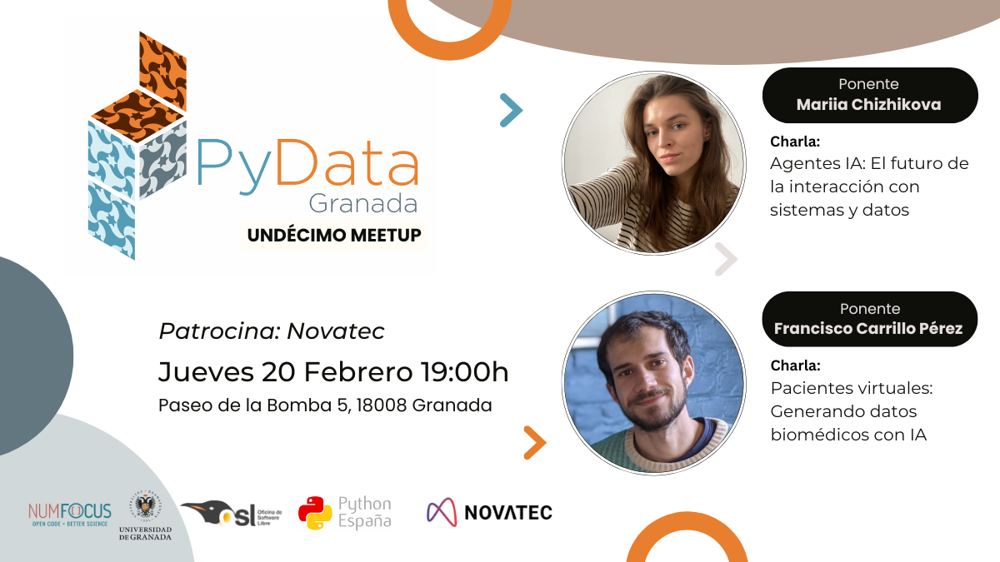

---

# Undécimo Meetup 20-02-2025

## Ponentes (por orden de intervención):
- **[Mariia Chizhikova](https://www.linkedin.com/in/mariia-chizhikova/)**     Ingeniera de modelos de lenguaje en Seraf AI

Como Ingeniera de Modelos de Lenguaje, combino mi formación académica en Filología Hispánica con una sólida especialización en Inteligencia Artificial. Mi trayectoria refleja un proceso de aprendizaje progresivo y metódico, iniciado de manera autodidacta a través de programas educativos en línea, y consolidado mediante la realización de un máster en Tecnologías de Lenguaje, así como mi experiencia en grupos de investigación, lo que me permitió hacer una transición exitosa hacia la industria.
En paralelo a mi labor técnica, mantengo un fuerte compromiso con la democratización del conocimiento en IA. Esta visión se materializa a través de mi proyecto de divulgación científica @mariia.en.ia en Instagram, donde busco tender puentes entre la innovación tecnológica y el público general.
- **[Francisco Carrillo Pérez ](https://www.linkedin.com/in/franciscocp/)** es un ingeniero informático especializado en el uso de modelos de aprendizaje máquina para datos biomédicos multimodales. Doctor por la Universidad de Granada en 2023, también trabajó como investigador postdoctoral en la Universidad de Stanford. Actualmente trabaja como Senior Scientist en la farmacéutica Bristol Myers Squibb.

## Descripcion de las charlas

###    Agentes IA: El futuro de la interacción con sistemas y datos..([Slides](slides_mariia.pdf))

Los Agentes IA están redefiniendo la forma en que interactuamos con sistemas y datos, evolucionando más allá de simples chatbots para convertirse en asistentes autónomos capaces de razonar, planificar y ejecutar tareas complejas. En esta charla, exploraremos la arquitectura que hace posible esta revolución: desde los modelos de lenguaje que actúan como cerebro, hasta las herramientas que les permiten interactuar con el mundo real y la capa de orquestación que gobierna su toma de decisiones.

Descubriremos cómo los agentes pueden utilizar diferentes tipos de herramientas (Extensions, Functions y Data Stores) para acceder a APIs, bases de datos y servicios externos, permitiéndoles realizar tareas que van desde la búsqueda de vuelos hasta el análisis de datos complejos. Para ilustrar estos conceptos en acción, concluiremos con una demostración práctica de cómo implementar un agente capaz de traducir lenguaje natural a consultas SQL, mostrando el potencial de estas tecnologías para democratizar el acceso a datos y sistemas.

**Ponente:** [Mariia Chizhikova](https://www.linkedin.com/in/mariia-chizhikova/)

### Pacientes virtuales. Generando datos biomédicos con IA.. ([Slides](slides_paco.pdf))

El uso de datos biomédicos de pacientes se ha multiplicado en los últimos años. Desde análisis de sangre y muestras digitalizadas de tejido hasta la secuenciación completa del genoma, cada vez se almacenan más datos que describen, desde múltiples perspectivas, el estado de un paciente y su enfermedad.

Además, gracias al uso de Python y librerías como Pytorch o Keras, se han conseguido crear modelos de deep learning capaces de igualar o superar la tasa de diagnóstico de médicos experimentados. Sin embargo, no todos los centros médicos tienen acceso a las mismas tecnologías, lo que dificulta el estudio de enfermedades en grupos de pacientes diversos y la creación de estos modelos. En esta charla exploraremos cómo los modelos generativos, programados en Python, pueden “imputar" los datos biomédicos faltantes. Este avance nos acerca a la creación de "pacientes virtuales" (in silico), que permitirán investigar la biología de las enfermedades sin necesidad de obtener nuevos datos de pacientes reales.

**Ponente:** [Francisco Carrillo Pérez ](https://www.linkedin.com/in/franciscocp/)

