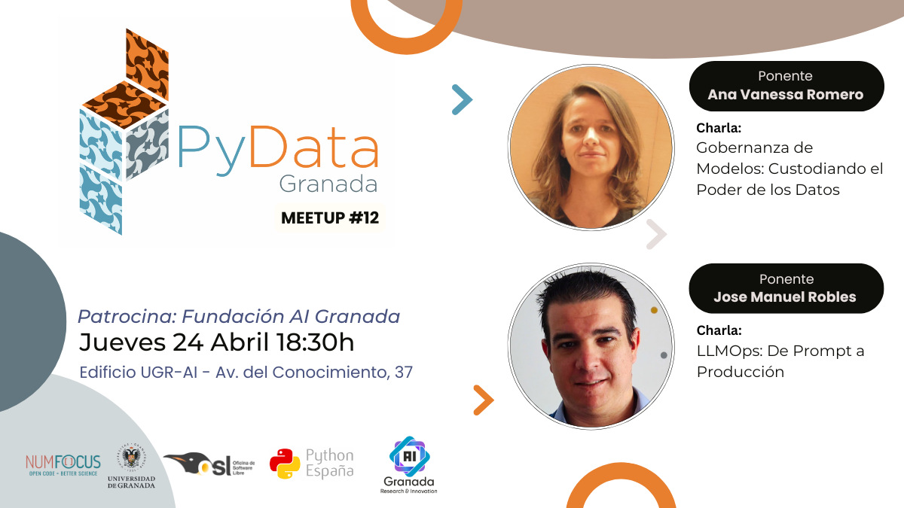

---

# Duodécimo Meetup 24-04-2025

## Ponentes (por orden de intervención):
- **[Vanesa Romero](https://www.linkedin.com/in/vanesa-romero-a374065b/)**     es Gerente de Analítica Comercial en Banco de Crédito Cooperativo

Soy licenciada en Matemáticas y llevo casi 20 años como Gerente de Analítica Comercial en el Grupo Cooperativo Cajamar. Durante este tiempo, he trabajado con diversas herramientas, técnicas y necesidades estratégicas para la entidad. A lo largo de estos años, he complementado mi formación con un máster en Marketing, Business Analytics y formación especializada en conocimientos bancarios (EFA). Esto me ha permitido abarcar las distintas facetas de la Ciencia de datos: Estadística, Machine Learning y Conexión con el Negocio. En mi día a día, participo en la implementación de modelos de Inteligencia Artificial, colaborando con equipos de negocio, marketing y TI para desarrollar soluciones analíticas que ayudan en la toma de decisiones, optimizan recursos y mejoran la experiencia de nuestros clientes.

- **[Chema Robles ](https://www.linkedin.com/in/roblesjm/)** Backend Engineer | Co-founder Montevive.Ai | VP Eng Gridfy.ai
## Descripcion de las charlas

###    Gobernanza de Modelos: Custodiando el Poder de los Datos. ([Slides](slides_vanesa.pdf))

En esta charla, exploraremos la importancia de la gobernanza de modelos en la gestión de datos y la toma de decisiones empresariales. En el entorno financiero actual, y con el impulso del Reglamento Europeo de Inteligencia Artificial, es crucial que estos modelos sean robustos y eficaces, y que sus políticas de uso estén bien definidas para tomar decisiones estratégicas. Hablaremos sobre cómo las políticas y procedimientos de gobernanza garantizan la correcta creación, implementación y seguimiento de los modelos de Inteligencia Artificial. Además, profundizaremos en el uso de Next Best Actions (NBAs) y cómo la gobernanza de modelos puede mejorar la toma de decisiones, gestionar riesgos, proporcionar transparencia y trazabilidad, y optimizar recursos. Presentaremos ejemplos prácticos para ilustrar cómo estos conceptos se aplican en la práctica y los beneficios que aportan a las organizaciones.

**Ponente:** [Vanesa Romero](https://www.linkedin.com/in/vanesa-romero-a374065b/)

### Pacientes virtuales. Generando datos biomédicos con IA.. ([Slides](slides_chema.pdf))

Chema Robles mostrará cómo llevar aplicaciones con LLMs a producción de manera profesional y robusta. Durante esta charla práctica, compartirá las mejores prácticas y herramientas esenciales para desplegar, mantener y monitorizar aplicaciones basadas en LLMs. Aprende cómo gestionar múltiples modelos de manera unificada con LiteLLM, implementar monitorización avanzada de prompts y costes usando LangFuse, y descubre estrategias clave para optimizar el rendimiento y mantener servicios de IA confiables en producción.

**Ponente:** [Chema Robles ](https://www.linkedin.com/in/roblesjm/)

