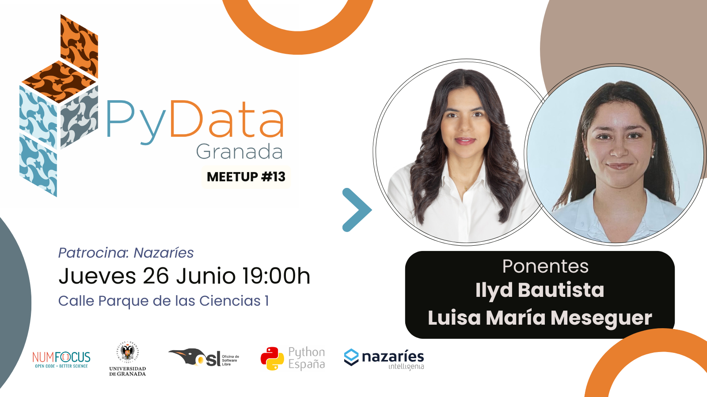

---

# Decimotercero Meetup 26-06-2025

## Ponentes (por orden de intervención):

- **[Ilyd Bautista](https://www.linkedin.com/in/bautista1/)** (AI Engineer en AOD)
 
es Ingeniera Civil con experiencia en planeación y ejecución de proyectos de infraestructura que decidió enfocar su carrera en el poder transformador de los datos y la inteligencia artificial. Apasionada por entender patrones complejos y convertirlos en soluciones inteligentes, se ha especializado en arquitecturas adaptativas de deep learning, optimización dinámica y clasificación multi-objetivo. Su enfoque combina rigor técnico con una profunda curiosidad por cómo la tecnología puede adaptarse a los desafíos del mundo real.

- **[Luisa María Meseguer Pérez](https://www.linkedin.com/in/luisa-mar%C3%ADa-meseguer-p%C3%A9rez-4625122a9/)**  (NLP Data Scientist en Fujitsu)

Es ingeniera informática por la Universidad de Granada, especializada en Computación y Sistemas Inteligentes. Actualmente aplica modelos avanzados de procesamiento del lenguaje natural. Ha desarrollado un proyecto de investigación sobre optimización de carteras de inversión mediante modelos QUBO y computación cuántica, en colaboración con la Cátedra “Tecnología para las personas”. Realizó una estancia académica en la Universidad de Oxford, donde profundizó en tecnologías emergentes, y mantiene una estrecha relación con el sector espacial a través de su participación en iniciativas como la International Space University (ISU) y Astro Aid.

## Descripcion de las charlas

### Optimización Adaptativa en Redes Neuronales: Estrategias de Aprendizaje Dinámico para Clasificación Multi-Objetivo.  ([Slides](slides_ilyd.pdf))

Exploramos técnicas innovadoras para adaptar dinámicamente las arquitecturas de redes neuronales durante el entrenamiento, combinando estrategias de ensamblado dinámico con mecanismos de atención evolutivos. Demostramos cómo estos sistemas pueden auto-optimizarse para diferentes tipos de patrones en los datos, ajustando automáticamente su estructura interna para maximizar tanto la precisión como la generalización en tareas de clasificación de alta complejidad.

**Ponente: [Ilyd Bautista](https://www.linkedin.com/in/bautista1/)**

### Más allá de los (qu)bits: optimización de carteras con computación cuántica. ([Slides](slides_luisa.pdf))

¿Es posible usar un ordenador cuántico para tomar mejores decisiones financieras? En esta charla exploraremos cómo formular el clásico problema de optimización de carteras —donde buscamos maximizar retorno y minimizar riesgo— en un lenguaje que un ordenador cuántico pueda entender. Veremos cómo se traduce a un problema QUBO, cómo se implementa en Qiskit y qué ventajas puede tener frente a los métodos tradicionales. A través de ejemplos prácticos, aprenderás cómo combinar tus conocimientos de ciencia de datos con las nuevas capacidades cuánticas y qué futuro nos espera en la intersección entre finanzas, optimización y física cuántica.

**Ponente: [Luisa María Meseguer Pérez](https://www.linkedin.com/in/luisa-mar%C3%ADa-meseguer-p%C3%A9rez-4625122a9/)**

---

# Thirteenth Meetup – 06/26/2025

## Speakers (in order of appearance):

- **[Ilyd Bautista](https://www.linkedin.com/in/bautista1/)** (AI Engineer at AOD)

  She is a Civil Engineer with experience in planning and executing infrastructure projects who decided to shift her career toward the transformative power of data and artificial intelligence. Passionate about understanding complex patterns and turning them into intelligent solutions, she has specialized in adaptive deep learning architectures, dynamic optimization, and multi-objective classification. Her approach combines technical rigor with deep curiosity about how technology can adapt to real-world challenges.

- **[Luisa María Meseguer Pérez](https://www.linkedin.com/in/luisa-mar%C3%ADa-meseguer-p%C3%A9rez-4625122a9/)** (NLP Data Scientist at Fujitsu)

  She holds a degree in Computer Engineering from the University of Granada, specializing in Computing and Intelligent Systems. Currently, she applies advanced natural language processing models. She developed a research project on portfolio optimization using QUBO models and quantum computing, in collaboration with the “Technology for People” Chair. She completed an academic stay at the University of Oxford, where she deepened her knowledge of emerging technologies, and maintains a close connection to the space sector through her participation in initiatives such as the International Space University (ISU) and Astro Aid.

## Talk Descriptions

### Adaptive Optimization in Neural Networks: Dynamic Learning Strategies for Multi-Objective Classification ([Slides](slides_ilyd.pdf))

We explore innovative techniques to dynamically adapt neural network architectures during training, combining dynamic ensemble strategies with evolutionary attention mechanisms. We demonstrate how these systems can self-optimize for different types of data patterns, automatically adjusting their internal structure to maximize both accuracy and generalization in complex classification tasks.

**Speaker: [Ilyd Bautista](https://www.linkedin.com/in/bautista1/)**

### Beyond (qu)bits: Portfolio Optimization with Quantum Computing ([Slides](slides_luisa.pdf))

Is it possible to use a quantum computer to make better financial decisions? In this talk, we’ll explore how to formulate the classic portfolio optimization problem — where we seek to maximize return and minimize risk — in a language a quantum computer can understand. We'll see how it’s translated into a QUBO problem, implemented in Qiskit, and what advantages it may offer over traditional methods. Through practical examples, you'll learn how to combine your data science knowledge with new quantum capabilities and what the future holds at the intersection of finance, optimization, and quantum physics.