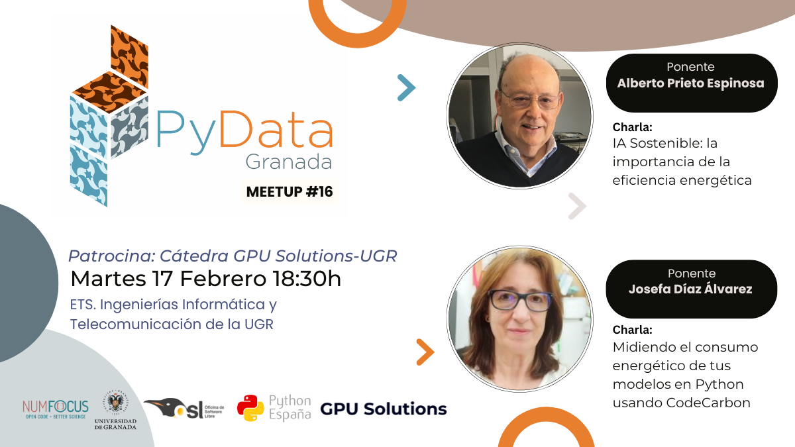

---

# Decimosexto Meetup – 17/02/2026

## Ponentes (por orden de intervención)

- **Alberto Prieto Espinosa** (Universidad de Granada)

Profesor Emérito del Departamento de Ingeniería de Computadores, Automática y Robótica de la Universidad de Granada. Es coautor de más de 250 artículos en revistas o congresos científicos y miembro numerario de la Academia de Ciencias Matemáticas, Físico-Químicas y Naturales de Granada. Participó en la creación y puesta en marcha del Centro de Servicios de Informática, de la Escuela Técnica Superior de Ingenierías de Informática y Telecomunicación, del Departamento de Arquitectura y Tecnología de Computadores y del Centro de Investigación en Tecnologías de la Información y de las Comunicaciones (CITIC-UGR). Es autor de distintos libros de texto sobre su especialidad y, en los últimos años, ha publicado en abierto su curso de Fundamentos de Informática en forma de vídeo-clases, con más de 100 vídeos originales en su canal de YouTube, más de 6.000 suscriptores y casi un millón de visitas.

- **Josefa Díaz Álvarez** (Universidad de Extremadura)

Profesora Titular de Universidad del Departamento de Arquitectura y Tecnología de Computadores en la Universidad de Extremadura (UEX) e investigadora en el Grupo de Evolución Artificial de la UEX. Doctora por la Universidad Complutense de Madrid. Cuenta con 65 publicaciones nacionales e internacionales en congresos y revistas de impacto. Ha participado o dirigido más de 22 proyectos de investigación (nacional, regional y programa universitario). Su campo de investigación es multidisciplinar, centrado principalmente en la aplicación de inteligencia artificial a problemas reales en el campo de la salud, la agricultura y la eficiencia energética desde el punto de vista de la reconfiguración hardware y la optimización de algoritmos bioinspirados.

---

## Descripción de las charlas

### IA Sostenible: la importancia de la eficiencia energética ([Slides](slides_alberto.pdf))

Esta charla trata sobre la evolución global del consumo energético de los sistemas informáticos en general, y en particular el ocasionado por las aplicaciones de IA. También se abordan los procedimientos que se están utilizando para reducir dicho consumo y mejorar la eficiencia energética.

**Ponente: Alberto Prieto Espinosa**

---

### Midiendo el consumo energético de tus modelos en Python usando CodeCarbon

El uso de la inteligencia artificial (IA) está consolidado como una herramienta clave para dar respuesta a problemas reales en todos los ámbitos, a lo que se suma el rápido crecimiento de la IA generativa. Este avance conlleva un incremento significativo del consumo energético y un impacto ambiental a tener en cuenta, especialmente en los centros de datos. En este contexto, herramientas como CodeCarbon permiten medir y analizar el impacto energético y ambiental de las soluciones propuestas, comparar distintos enfoques y promover prácticas de Green AI. Este tipo de análisis facilita el desarrollo de sistemas de IA optimizados, más precisos y escalables, al tiempo que mejora su eficiencia energética y sostenibilidad.

**Ponente: Josefa Díaz Álvarez**

---

---

# Sixteenth Meetup – 02/17/2026

## Speakers (in order of appearance)

- **Alberto Prieto Espinosa** (Universidad de Granada)

Emeritus Professor in the Department of Computer Engineering, Automation and Robotics at the University of Granada. He is co-author of more than 250 articles in scientific journals and conferences, and a full member of the Academy of Mathematical, Physical-Chemical and Natural Sciences of Granada. He participated in the creation and launch of the Computing Services Center, the Higher Technical School of Computer and Telecommunications Engineering, the Department of Computer Architecture and Technology, and the Research Center for Information and Communication Technologies (CITIC-UGR). He is the author of several textbooks in his field, and in recent years has published an open-access Fundamentals of Computing course as video lectures, with over 100 original videos on his YouTube channel, more than 6,000 subscribers, and nearly one million views.

- **Josefa Díaz Álvarez** (Universidad de Extremadura)

Associate Professor in the Department of Computer Architecture and Technology at the University of Extremadura (UEX) and researcher in the Artificial Evolution Group at UEX. She holds a PhD from the Complutense University of Madrid. She has 65 national and international publications in conferences and high-impact journals, and has participated in or led more than 22 research projects (national, regional, and university programmes). Her research field is multidisciplinary, focused mainly on the application of artificial intelligence to real-world problems in healthcare, agriculture, and energy efficiency from the perspective of hardware reconfiguration and the optimization of bio-inspired algorithms.

---

## Talk Descriptions

### Sustainable AI: The Importance of Energy Efficiency ([Slides](slides_alberto.pdf))

This talk addresses the global evolution of energy consumption in computing systems in general, and in particular that caused by AI applications. It also covers the procedures being used to reduce such consumption and improve energy efficiency.

**Speaker: Alberto Prieto Espinosa**

---

### Measuring the Energy Consumption of Your Python Models Using CodeCarbon

The use of artificial intelligence (AI) is established as a key tool for addressing real-world problems across all domains, further compounded by the rapid growth of generative AI. This advancement entails a significant increase in energy consumption and an environmental impact that must be considered, especially in data centers. In this context, tools such as CodeCarbon allow measuring and analyzing the energy and environmental impact of proposed solutions, comparing different approaches, and promoting Green AI practices. This type of analysis facilitates the development of optimized AI systems that are more accurate and scalable, while improving their energy efficiency and sustainability.

**Speaker: Josefa Díaz Álvarez**
