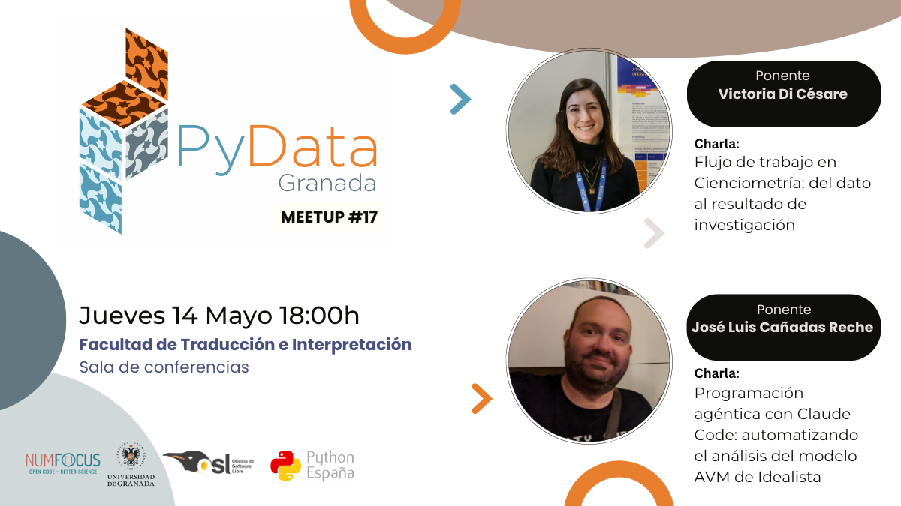

---

# Decimoséptimo Meetup – 14/05/2026

## Ponentes (por orden de intervención)

- **Victoria Di Césare** (Universidad de Granada)

Es estudiante doctoral en la Universidad de Granada, donde trabaja como contratada FPI y forma parte de la Unidad de Humanidades y Ciencias Sociales Computacionales (U-CHASS). Se encuentra próxima a finalizar su doctorado en Ciencias Sociales, siendo su área de especialidad la Ciencia de la Ciencia. Su formación previa es en Estudios de la Ciencia y la Tecnología y en Ciencia de la Información.

- **José Luis Cañadas Reche** (Data Scientist en idealista)

Es data scientist en idealista, la mayor plataforma inmobiliaria de España. Diplomado en Estadística y licenciado en Investigación de Mercados por la Universidad de Granada, completó su formación con un Máster en Estadística Aplicada. Antes de idealista trabajó en Orange y Telefónica, acumulando más de una década de experiencia aplicando estadística y machine learning en entornos de producción. Es vicepresidente de la Comunidad R-Hispano, asociación que promueve el uso de R en investigación, educación y empresa en el mundo hispanohablante. Escribe el blog Muestrear no es pecado, donde aborda muestreo, inferencia causal, métodos bayesianos y Machine Learning en diferentes lenguajes.

---

## Descripción de las charlas

### Flujo de trabajo en Cienciometría: del dato al resultado de investigación ([Slides](slides_victoria.pdf))

La Cienciometría es una rama de la Ciencia de la Ciencia dedicada al análisis cuantitativo de diferentes aspectos de la actividad científica. Entre ellos, podríamos destacar el estudio de la colaboración científica, la evaluación de los investigadores y la comunicación científica, donde las bases de datos, las revistas y los artículos son protagonistas. Las mediciones e indicadores cienciométricos utilizados para dar respuesta a preguntas de investigación sobre todos estos temas están basados en el procesamiento de datos provenientes de diferentes fuentes. Algunas de las más utilizadas son las bases de datos bibliográficas, cuyas formas de acceso, cobertura, metadatos, formatos y calidad de los datos varían considerablemente. A esta complejidad se suma la de las variadas herramientas y sistemas que, según sus prestaciones, intervienen en distintas partes del procesamiento de datos. Sin embargo, el fin último de la Cienciometría no radica en los datos en sí mismos sino en generar resultados interpretables. Por ello, es muy importante contar con una metodología de trabajo ordenada que nos permita combinar fuentes, cambiar de formatos y pasar de una herramienta a otra de la forma más eficiente posible y sin perder información en el camino. En esta charla nos centraremos en un caso de investigación real para conocer algunos de los principales pasos y herramientas que forman parte de un flujo de trabajo con datos en Cienciometría.

**Ponente: Victoria Di Césare**

---

### Programación agéntica con Claude Code: automatizando el análisis del modelo AVM de idealista ([Slides](slides_joseluis.html))

En el día a día como data scientist, las incidencias recurrentes sobre el modelo de valoración automática de idealista obligaban a lanzar consultas manuales contra ClickHouse una y otra vez: mismas queries, mismo análisis, mismo informe. La solución fue convertir ese flujo en una skill de Claude Code, una herramienta que el agente invoca de forma autónoma para consultar los datos, generar visualizaciones de evolución de precios y producir un informe HTML reproducible con Quarto. En la charla cuento cómo se construye algo así desde dentro: primero en R para iterar rápido y validar la lógica de negocio, luego en Python como versión complementaria para integrarse con otros flujos. Más allá de la implementación concreta, el aprendizaje más valioso es sobre la forma de trabajar: con un agente como colaborador, el lenguaje de programación deja de ser el cuello de botella y el foco vuelve donde debe estar, en el conocimiento del dominio.

**Ponente: José Luis Cañadas Reche**

---

---

# Seventeenth Meetup – 05/14/2026

## Speakers (in order of appearance)

- **Victoria Di Césare** (Universidad de Granada)

She is a doctoral student at the University of Granada, working as an FPI-funded researcher and member of the Unit of Computational Humanities and Social Sciences (U-CHASS). She is close to completing her doctorate in Social Sciences, with Science of Science as her area of specialization. Her prior training is in Science and Technology Studies and Information Science.

- **José Luis Cañadas Reche** (Data Scientist at idealista)

He is a data scientist at idealista, the largest real estate platform in Spain. He holds a Diploma in Statistics and a degree in Market Research from the University of Granada, and completed his training with a Master's in Applied Statistics. Before idealista, he worked at Orange and Telefónica, accumulating over a decade of experience applying statistics and machine learning in production environments. He is Vice President of the R-Hispano Community, an association that promotes the use of R in research, education, and business in the Spanish-speaking world. He writes the blog Muestrear no es pecado, where he covers sampling, causal inference, Bayesian methods, and Machine Learning in different languages.

---

## Talk Descriptions

### Scientific Workflow in Scientometrics: From Data to Research Output ([Slides](slides_victoria.pdf))

Scientometrics is a branch of the Science of Science dedicated to the quantitative analysis of different aspects of scientific activity. Among others, we can highlight the study of scientific collaboration, researcher evaluation, and scientific communication, where databases, journals, and articles take center stage. The measurements and scientometric indicators used to address research questions on all these topics are based on the processing of data from different sources. Some of the most widely used are bibliographic databases, whose access methods, coverage, metadata, formats, and data quality vary considerably. This complexity is compounded by the variety of tools and systems that, depending on their capabilities, intervene in different parts of data processing. However, the ultimate goal of Scientometrics does not lie in the data itself, but in generating interpretable results. Therefore, having an orderly work methodology that allows us to combine sources, change formats, and move from one tool to another as efficiently as possible — without losing information along the way — is essential. This talk will focus on a real research case to explore some of the main steps and tools that make up a data workflow in Scientometrics.

**Speaker: Victoria Di Césare**

---

### Agentic Programming with Claude Code: Automating the Analysis of idealista's AVM Model ([Slides](slides_joseluis.html))

In day-to-day work as a data scientist, recurring incidents with idealista's automated valuation model meant manually running the same queries against ClickHouse over and over: same queries, same analysis, same report. The solution was to turn that workflow into a Claude Code skill — a tool the agent invokes autonomously to query the data, generate price evolution visualizations, and produce a reproducible HTML report with Quarto. The talk covers how something like this is built from the inside: first in R to iterate quickly and validate the business logic, then in Python as a complementary version to integrate with other workflows. Beyond the specific implementation, the most valuable lesson is about how to work: with an agent as a collaborator, the programming language stops being the bottleneck and the focus returns to where it belongs — domain knowledge.

**Speaker: José Luis Cañadas Reche**
