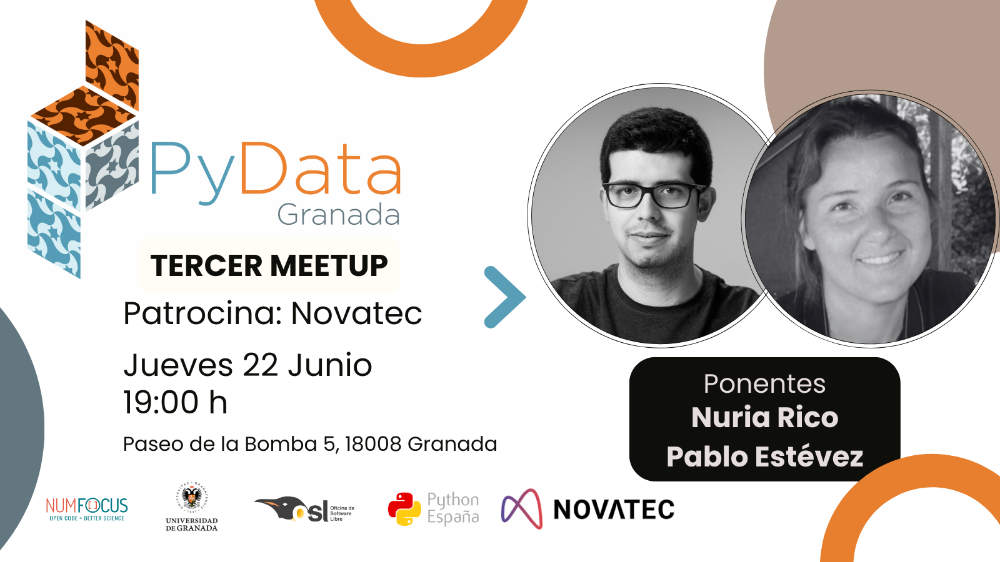

---

# Tercer Meetup 22-06-2023
## Ponentes:
- **Nuria Rico:** Profesora de Estadística en la Universidad de Granada, ha sido parte de la Oficina de Software Libre y Directora de Secretariado de Datos Abiertos en esta universidad. Participa de forma activa en la promoción de las ciencias y las técnicas así como en la divulgación de la estadísica y la ciencia de datos. Realiza trabajos interdisciplinares de investigación, ocupándose del análisis de datos en áreas tan diversas como la ligüística o la ingeniería química.
- **Pablo Estévez:**
  Es Ingeniero de Telecomunicaciones y trabaja como Site Reliability Engineer (SRE) en Novatec. Es responsable del desarrollo y mantenimiento de sistemas de software fiables, escalables y seguros. También tiene curiosidad por la inteligencia artificial y sus aplicaciones en diferentes dominios, como la ciberseguridad y la infraestructura.
## Descripcion de las charlas
### Clasificación basada en datos. ([Slides](pydata_clasificacion.pdf))
Las técnicas de clasificación nos permiten obtener particiones de elementos para segmentar poblaciones de forma que se pueden establecer grupos de individuos con características comunes entre ellos y que a su vez sean diferentes de los elementos de otros grupos. Encontrar agrupaciones basándonos en datos es un tema que ha sido abordado mediante las técnicas estadísticas de análisis multivariante, concretamente las llamadas técnicas de análisis cluster, que se desarrollaron el siglo pasado. La facilidad con que hoy en día se obtienen, almacenan y analizan datos hace que se utilicen este tipo de técnicas en multitud de ocasiones, frecuentemente sin entender del todo cuáles son las normas por las que se rigen. En esta charla, la ponente explicará los fundamentos de las técnicas de análisis cluster más habituales y cómo funcionan. 

**Ponente:** Nuria Rico

### ¿Puede la estadística superar a la Inteligencia Artificial? ([Slides](pydata_anomalias.pdf))

La detección de anomalías es el proceso de identificar patrones inusuales o anormales en los datos que se desvían del comportamiento esperado. Tiene muchas aplicaciones en diversos ámbitos, como la ciberseguridad, la detección de fraudes, la atención sanitaria y la supervisión industrial. En esta charla, exploraré si la inteligencia artificial (IA) es siempre la mejor opción para la detección de anomalías, o si hay casos en los que los métodos estadísticos tradicionales pueden superar o complementar a la IA. Me centraré en dos métodos que utilizan la reducción de la dimensionalidad para encontrar las características más relevantes de los datos: Principal Component Analysis (PCA), un método lineal que utiliza transformaciones ortogonales, y un Autoencoder, una topología de red neuronal que aprende a comprimir y reconstruir los datos. Compararé los puntos fuertes y débiles de estos métodos y mostraré algunos ejemplos de su rendimiento en conjuntos de datos del mundo real. También discutiré algunos retos y futuras direcciones para la investigación en detección de anomalías.

**Ponente:** Pablo Estévez