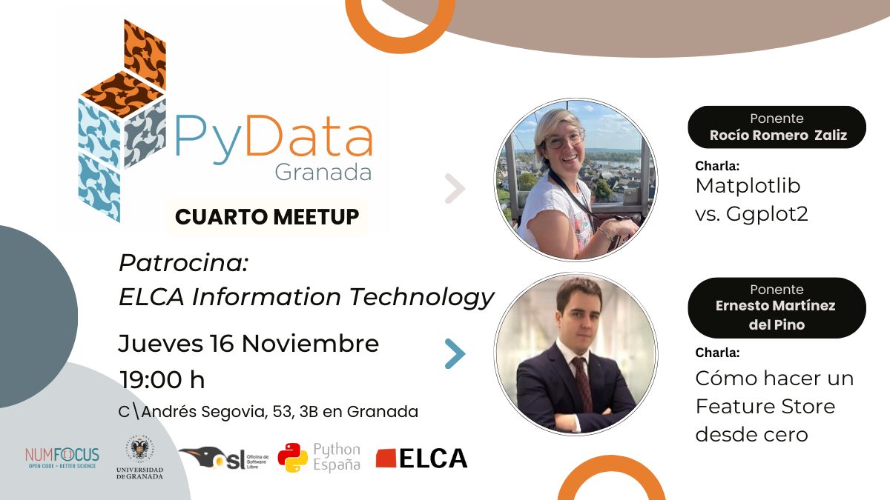

---

# Cuarto Meetup 22-06-2023
## Ponentes:
- **Ernesto Martinez del Pino**
  Ernesto Martínez del Pino lidera el equipo de Machine Learning Engineering de Syngenta Global. Es CTO y cofounder de Omniaintel, una startup de AI y Bigdata dedicada a la medición de la calidad del aire. Colabora con la startup financiera Menhir en la creación y diseño de productos. Ha impartido dos años consecutivos las asignaturas de Procesamiento de Datos e Inteligencia Artificial en Máster en Data Strategy & Analytics como profesor adjunto en Miotic. Es especialista en el desarrollo de productos relacionados con medioambiente, meteorología, fraude, banca y real estate. Muestra un gran interés por la creación y participación de nuevas startups.
- **Rocio Romero Zaliz:**
  Rocío Romero Zaliz es docente e investigadora en el Departamento de Ciencias de la Computación e Inteligencia Artificial de la Universidad de Granada. Forma parte del comité de difusión y comunicación del Instituto Andaluz de Investigación en Ciencia de Datos e Inteligencia Computacional (Instituto DaSCI) y es subdirectora de transferencia, docencia e investigación del Centro de Investigación en Tecnologías de la Información y las Comunicaciones (CITIC-UGR). Se especializa en temas interdisciplinares en diversos campos, como la física, las matemáticas, la biología y la medicina. Ademas es divulgadora científica ya que además de dar charlas y participar en eventos como La Noche de los Investigadores, también es co-presentadora del podcast SintonIA ("La IA en las ondas") en donde divulga temas relacionados con la IA y la ciencia de datos.
## Descripcion de las charlas

### Cómo hacer un Feature Store desde cero ([Slides](-))

Adéntrate en el apasionante mundo de la creación de productos basados en Inteligencia Artificial. Optimiza el tiempo de desarrollo de tus equipos de Data Scientists. Minimiza la puesta en producción de tus modelos predictivos creando herramientas transversales entre proyectos. Madura tu ecosistema de paquetes reutilizables. En esta charla obtendrás las pautas necesarias para desarrollar uno de los componentes principales de la Ingeniería del Aprendizaje Automático, el Feature Store o Almacén de Características. Transforma tus variables en un producto de consumo interno y externo fácilmente accesible.

**Ponente:** Ernesto Martinez del Pino

### Matplotlib vs. Ggplot2 ([Slides](pydata_matplotlib.pdf))
¡Prepárate para una batalla épica de visualización de datos entre Matplotlib y ggplot2! Enfrentaremos a estos dos gigantes de la visualización y descubriremos quién gana en flexibilidad y control, y quién se alza con la victoria en elegancia y eficiencia ¡Esta es tu oportunidad para elegir tu bando y aprender cuál de estas bibliotecas liderará tu próxima aventura en visualización de datos!

**Ponente:** Rocio Romero Zaliz