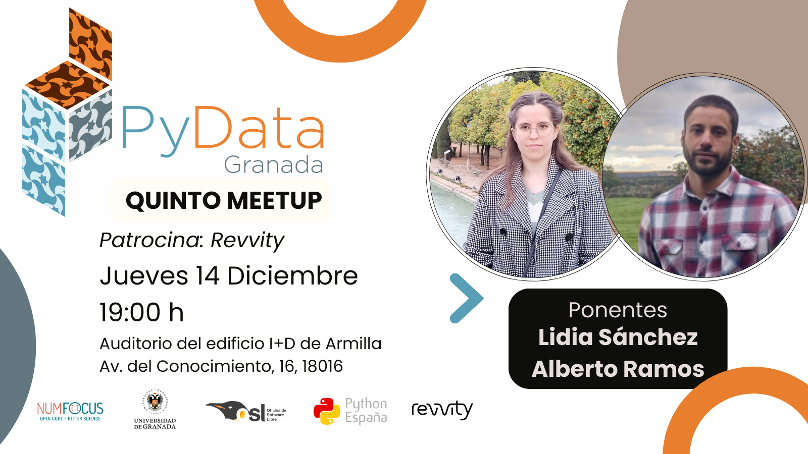

---

# Quinto Meetup 15-12-2023
## Ponentes:
- **Alberto Ramos Álvarez**
  Alberto, licenciado en Ciencias Físicas, se doctoró con premio extraordinario en Santiago de Compostela en la especialidad de materiales cuánticos. Ha participado en experimentos en centros de investigación alrededor del mundo, incluyendo Finlandia y Japón. Trabajó como científico en el ICFO, un centro de excelencia internacional especializado en fotónica situado en Barcelona, contribuyendo al diseño y construcción de un microscopio de resolución temporal a escala de femtosegundos. Actualmente, Alberto aplica su conocimiento como científico de datos en Revvity, una destacada compañía estadounidense enfocada en el sector farmacéutico y la biotecnología.
- **Lidia Sánchez Mérida:**
  Lidia es Ingeniera Informática especializada en Ciencia de Datos y actualmente trabaja principalmente como Azure Data Engineer en UST dentro del ámbito financiero internacional.
## Descripcion de las charlas

###  Análisis datos en Drug Discovery: Cell Painting ([Slides](Alberto.pdf))

En esta charla exploraremos la técnica de Cell Painting, fundamental en biología celular. Utiliza sondas fluorescentes para marcar componentes clave como el núcleo, membrana y proteínas, generando imágenes detalladas de morfología y estructuras internas celulares. La importancia del Cell Painting va más allá de las imágenes, destacando su capacidad para extraer conocimientos. Abordaremos el uso de computación paralela en clústers para el análisis eficiente de grandes conjuntos de datos celulares. En investigación biomédica, esta técnica es valiosa para comprender reacciones celulares ante diversas condiciones. Su potencial prometedor contribuirá al desarrollo de terapias más efectivas y personalizadas en el futuro.

**Ponente:** Alberto Ramos Álvarez

### Python en la nube: versatilidad y eficiencia ([Slides](Lidia.pdf))
El despliegue de soluciones en la nube es cada vez la opción más elegida por las empresas para confiar el desarrollo de sus proyectos. Si bien existe un amplio abanico de servicios listos para su uso, no siempre se ajustan a los requerimientos necesarios, aumentando como consecuencia los costes y la complejidad de su mantenimiento. En multitud de ocasiones resulta más favorable la programación de soluciones personalizadas para procesos ETL/ELT en las que el conocimiento sobre Python y el cálculo de la eficiencia de un código son totalmente indispensables para proporcionar alternativas de calidad capaces de cumplir sus funciones bajo una inversión temporal y monetaria controlada.
**Ponente:** Lidia Sánchez Mérida

## Evento patrocinado por:
[Revvity](https://www.revvity.com/)