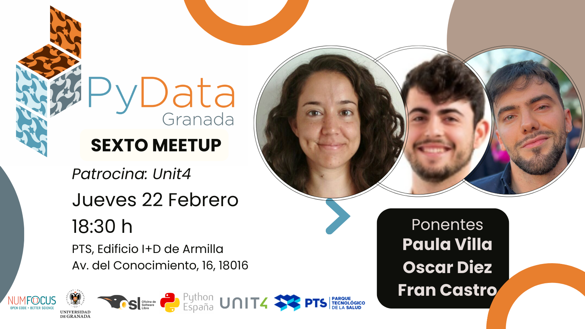

---

# Sexto Meetup 22-02-2024
## Ponentes:
- **Paula Villa Martín**
Paula Villa Martín es doctora en Física por la Universidad de Granada. Se unió a la compañía de software Unit4 en 2021 como Data Scientist, donde ayuda en la identificación, desarrollo y despliegue de soluciones de Machine Learning.
- **Oscar Diez Gómez**
Oscar Diez Gómez es graduado en Matemáticas por la Universidad de Málaga con postgrado en Ciencia de Datos por la Universidad de Granada. Trabaja en la compañía de software Unit4 desde 2021 como Product Manager involucrado en proyectos relacionados con IA y Ciencia de Datos.
- **Francisco Miguel Castro Macías:**
(Fran Castro) es graduado en Matemáticas y en Informática por la Universidad de Granada. Tiene un máster en Ciencia de Datos e Ingeniería de Computadores, también por la Universidad de Granada. Desde Julio de 2022 es miembro del grupo de investigación “Visual Information Processing”. Actualmente, es estudiante de doctorado bajo la supervisión de Rafael Molina, Pablo Morales, y Aggelos K. Katsaggelos. Su investigación se centra en el desarrollo de modelos probabilísticos para problemas inversos y débilmente supervisados, con aplicaciones en medicina.

## Descripcion de las charlas

###   RAG: Adopción/Integración de la IA Generativa en una empresa en la nube ([Slides](Paula-Oscar.pdf))

Exploraremos el revolucionario mundo de Generative AI y cómo puede ser aplicado en el software empresarial. Aprenderás:

- Introducción al novedoso mundo de Gen AI: Una introducción clara y concisa a Generative AI, LLM, ChatGPT.
- Fundamentos de la técnica RAG (Retrieval-Augmented Generation): Entender qué es y cómo nos ayuda a aprovechar al máximo las capacidades de Generative AI.
- Aplicación Práctica en Unit4: Casos de estudio reales donde este patrón ha sido implementado exitosamente, resaltando los desafíos, beneficios, y mejores prácticas.

**Ponente:** Paula Villa Martín & Óscar Diez Gómez

### Aprendiendo a clasificar imágenes médicas ([Slides](Fran.pdf))
Todos los métodos que conocemos para clasificar imágenes necesitan grandes cantidades de ejemplos etiquetados; imágenes a las que una o varias personas les han asignado una etiqueta. Si queremos usar estos métodos para diagnosticar enfermedades, necesitamos que los médicos etiqueten imágenes médicas. Sin embargo, el tiempo del que disponen los médicos es muy limitado y caro, por lo que es prácticamente imposible obtener grandes conjuntos de imágenes médicas anotadas manualmente. En esta charla exploraremos cómo podemos resolver este problema usando “paradigmas de etiquetado débil”. Profundizaremos en algunas aplicaciones, como la detección de hemorragias intracraneales o la detección de cáncer.
**Ponente:** Francisco Miguel Castro Macías

## Evento patrocinado por:
[Unit4](https://www.unit4.com/)
