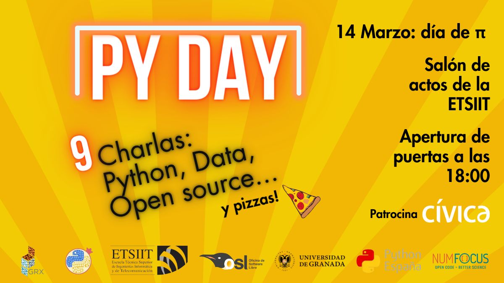

---

# Septimo Meetup 14-03-2024 PYDAY!

Desde PyData GRX y Python Granada os invitamos a participar en el 🐍 PyDay 2024. Con motivo del día de π, ambos grupos nos juntamos con un evento especial 🎉.

Contaremos con ⚡ 10 charlas relámpago de 10 minutos y 📢 una keynote de 25 minutos. Para finalizar, os invitaremos a pizzas 🍕 gracias al patrocinio de Cívica.

## Ponentes y diapositivas (por orden de aparición)

### Martina Kienberger 
"(Programming) Language Learning" 
([Slides](Charla_martina.pdf))

### Alberto Argente del Castillo Garrido 
"FLEXible, una librería para la simulación de experimentos de Aprendizaje Federado."
([Slides](charla_alberto.pdf))

### Manuel Martín 
"¿Puede la IA ayudar a reducir los accidentes de tráfico?"
([Slides](charla_manuel.pdf))

### Ana Muñoz Maquera 
"Conociendo Low-Code en Machine Learning con PyCaret"
([Slides](charla_ana.pdf))

### Javier Mayorgas Cobos 
"Aprende a diseñar una arquitectura ML efectiva"
([Slides](charla_javier))vas.

### Francisco Carrillo Pérez 
"No todo son imágenes de gatitos: modelos generativos en biomedicina"
([Slides](charla_francisco.pdf))

### Antonio Manjavacas 
"Aprendizaje por refuerzo en Python: una breve introducción"
([Slides](charla_antonio.pdf))

### Noelia Sánchez Gómez 
"Un paseo cuántico a través de Qiskit"
([Slides](https://www.canva.com/design/DAF_Cmta-O4/2VGyMBLX4rpfTH7hQS2Emw/view?utm_content=DAF_Cmta-O4&utm_campaign=designshare&utm_medium=link&utm_source=viewer))

### Daniel Molina Cabrera 
"Mostrando polar como alternativa a Pandas"
([Slides](https://polars.danimolina.net))

## KEYNOTE
### Juan Luis Cano Rodríguez 
"Lo menos importante del código abierto es el código"
([Slides](https://design.penpot.app/#/view/af2058fc-4f53-80f4-8004-0a3d1ddc9056?page-id=af2058fc-4f53-80f4-8004-0a3d1ddc9057&section=interactions&index=0&share-id=9d19625d-7d4c-80ec-8004-0ad84b98cf75))

## Evento patrocinado por:
[Cívica](https://civica-soft.com/)
