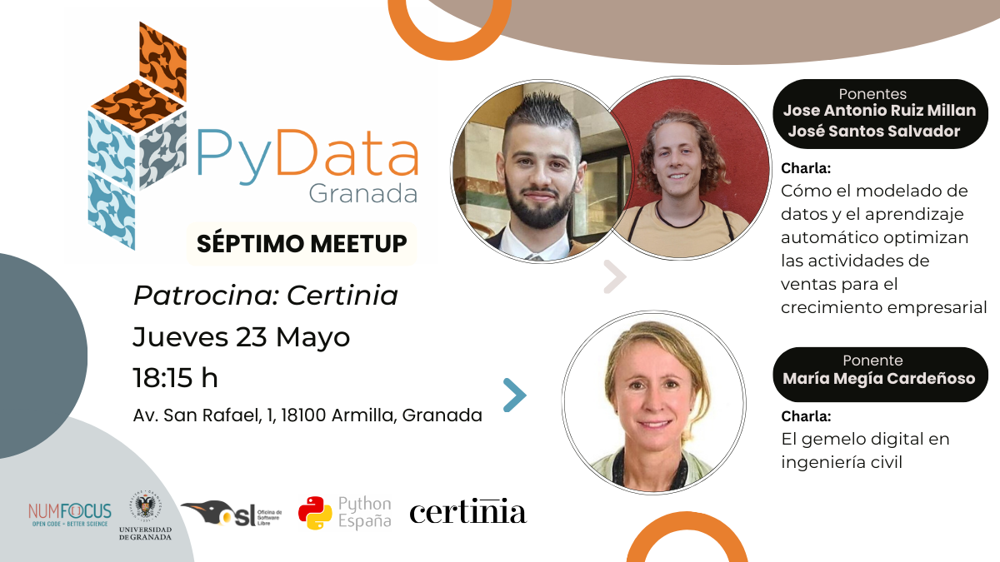

---

# Septimo Meetup 23-05-2024

## Ponentes (por orden de intervención):
- **José Antonio Ruiz Millán** es Data Engineer del equipo de datos de Certinia.
- **José Santos Salvador** es Data Engineer del equipo de datos de Certinia.
- **María Megía Cardeñoso** es ingeniera de caminos, canales y puertos por la Universidad de Granada, con 20 años de experiencia en obra civil y proyectos en España y América, y 5 años en ciencia de datos y machine learning. Consultora para la UE en los programas H2020 y Horizonte Europa, es especialista en I+D+i y recién doctorada en la tecnología del gemelo digital.[LinkedIn](http://www.linkedin.com/in/maria-megia-cardenoso).

## Descripcion de las charlas

###   Cómo el modelado de datos y el aprendizaje automático optimizan las actividades de ventas para el crecimiento empresarial ([Slides](JaJS.pdf))
En la era del Big Data, las empresas tienen acceso a grandes cantidades de información, pero es la utilización eficaz de estos datos lo que diferencia a las empresas de éxito. Aquí es donde entran en juego el modelado de datos y el aprendizaje automático, que ofrecen potentes herramientas para optimizar las actividades de ventas e impulsar el crecimiento empresarial. Esta charla explora cómo estas técnicas, implementadas utilizando Polars para el modelado de datos y scikit-learn para el aprendizaje automático, pueden revolucionar las estrategias de ventas. Exploraremos la importancia de la calidad de los datos, el modelado eficiente de datos y la aplicación de algoritmos de aprendizaje automático para mejorar el rendimiento de las ventas y lograr un crecimiento sostenible.

**Ponente:** José Antonio Ruiz Millán & José Santos Salvador

### El gemelo digital en ingeniería civil ([Slides](maria.pdf))
La ingeniería civil se encuentra en una coyuntura crítica del siglo XXI, enfrentando una serie de desafíos y oportunidades que demandan un cambio en las prácticas y metodologías tradicionales. Con numerosas estructuras construidas llegando al final de su vida útil, surge la necesidad imperiosa de implantar soluciones sostenibles y tecnológicamente avanzadas. Con el fin de abordar este desafío, se presenta un marco conceptual integral de gemelo digital, considerando aspectos como el envejecimiento de las infraestructuras y su digitalización, la necesidad de modelos analíticos que funcionen en tiempo real y la escasez de datos para su entrenamiento. Se investigan estrategias para la operación y mantenimiento, así como la adopción cohesionada de tecnologías digitales, como el Modelado de Información de Construcción (BIM), el Internet de las Cosas (IoT) y la Inteligencia Artificial (IA), empleando modelos de deep learning tanto generativos (conditional WGAN-GP) como predictivos (regresores y clasificadores basados en CNNs).

Notebooks de la charla: [Github](https://github.com/mmmmaria/Digital-twin)

**Ponente:** María Megía Cardeñoso

## Evento patrocinado por:
[Certinia](https://certinia.com/)
