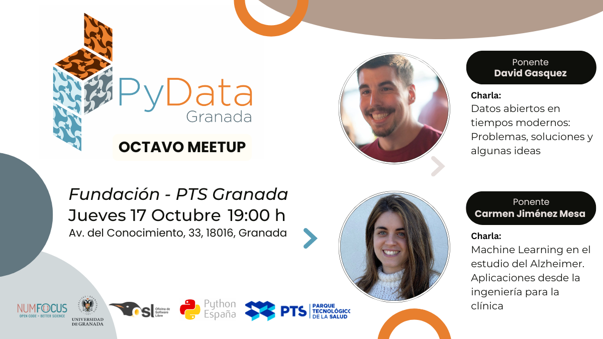

---

# Octavo Meetup 17-10-2024

## Ponentes (por orden de intervención):
- **[David Gasquez](https://davidgasquez.com/)** es un programador especializado en el mundo de los datos. Durante los últimos 8 años, ha trabajado como ingeniero de datos para varias empresas. Actualmente trabaja para Protocol Labs manteniendo su portal de datos abiertos.
- **[Carmen Jiménez Mesa](https://www.linkedin.com/in/carmen-jim%C3%A9nez-mesa-a32a42156/)** es una ingeniera electrónica que se ha especializado en el uso de aprendizaje máquina para aplicaciones biomédicas. Lleva 5 años como investigadora en la universidad de Granada, donde ha realizado un doctorado sobre cómo aplicar estas técnicas para mejorar el tratamiento de patologías como el Alzheimer, el Parkinson o la esquizofrenia.

## Descripcion de las charlas

###   Datos abiertos en tiempos modernos. Problemas, soluciones y algunas ideas. ([Slides](DavidGasquez.pdf))
Colaborar y usar datos para tomar decisiones es una tarea complicada, más aún cuando hay que usar datos públicos de varias fuentes. Sin embargo, gracias a nuevas tecnologías y estándares, es posible crear portales de datos abiertos que faciliten la colaboración y la reutilización de los datos.
¿Por qué no aprovechar tecnologías que usan las empresas para mejorar la calidad de los datos abiertos y fomentar la colaboración? En esta charla veremos cómo se puede crear un portal de datos abiertos moderno usando herramientas (DuckDB, Dagster, dbt) y estándares abiertos (Arrow, Parquet).

**Ponente:** [David Gasquez](https://davidgasquez.com/)

### Machine Learning en el estudio del Alzheimer. Aplicaciones desde la ingeniería para la clínica. ([Slides](CarmenJimenez.pdf))
El Alzheimer es una enfermedad compleja y su estudio requiere de la integración de múltiples fuentes de datos clínicos, neuroimágenes y biomarcadores. La interpretación de estos datos es un desafío, especialmente cuando la precisión y rapidez son clave para mejorar el diagnóstico y tratamiento. Sin embargo, gracias a los avances en aprendizaje máquina, es posible desarrollar herramientas que apoyen a los profesionales clínicos en la toma de decisiones. En esta charla exploraremos cómo podemos ayudar a los neurólogos en el diagnóstico del Alzheimer mediante procedimientos basados en datos que sean interpretables, explicables y responsables.

**Ponente:** [Carmen Jiménez Mesa](https://www.linkedin.com/in/carmen-jim%C3%A9nez-mesa-a32a42156/)

## Evento patrocinado por:
[Fundación PTS](https://ptsgranada.com/fundacion/)
