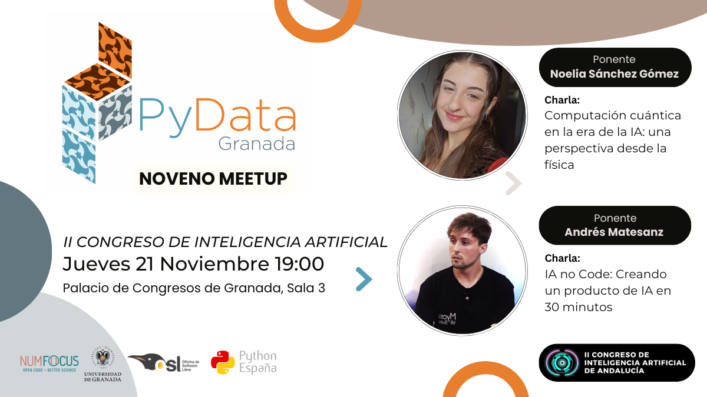

---

# Noveno Meetup 21-11-2024

Evento Especial incluido como Microevento dentro del [II Congreso de Inteligencia Artificial de Andalucía](https://www.juntadeandalucia.es/congresoIA/).

## Ponentes (por orden de intervención):
- **[Noelia Sánchez Gómez](https://www.linkedin.com/in/noelia-s%C3%A1nchez-g%C3%B3mez-8641b1214/)** Graduada en Física, estudiante del Máster de FisyMat de la UGR y becaria de investigación JAE en el Instituto de Estructura de la Materia.
- **[Andrés Matesanz](https://www.linkedin.com/in/aimatesanz/)** es Computer Vision Research Engineer en Sngular y cuenta con más de 5 años de experiencia en el desarrollo de tecnologías que permiten a los ordenadores "ver". Su trayectoria profesional se centra en proyectos de I+D, así como en la automatización de procesos de desarrollo de software.

## Descripcion de las charlas

###    Computación cuántica en la era de la IA: Una perspectiva desde la física. ([Slides](noeliasanchez.pdf))

En esta charla con perspectiva divulgativa daremos un paseo por las bases de la computación cuántica y sus propiedades físicas, para acabar conociendo algunos algoritmos cuánticos que podrían potenciar y acelerar la IA. Con la librería de Python Qiskit veremos ejemplos prácticos de como implementar estos algoritmos con circuitos cuánticos.

**Ponente:** [Noelia Sánchez Gómez](https://www.linkedin.com/in/noelia-s%C3%A1nchez-g%C3%B3mez-8641b1214/)

### IA no Code: Creando un producto de IA en 30 minutos. ([Slides](andresmatesanz.pdf))
¿Qué pensarías si te dijera que voy a crear, delante de ti, un producto perfectamente funcional en vivo, en directo y en media hora? ¡Pues créelo! Tendemos a pensar que introducir la IA en procesos de nuestro día a día es complejo y que requiere de muchos conocimientos técnicos, sin embargo, en esta charla te demuestro lo contrario. Veremos cómo, con las herramientas adecuadas, podemos generar un prototipo de un producto que gire entorno a la IA generativa con imágenes funcionando en muy poco tiempo ¡y sin tirar ni una sola línea de código!

**Ponente:** [Andrés Matesanz](https://www.linkedin.com/in/aimatesanz/)

